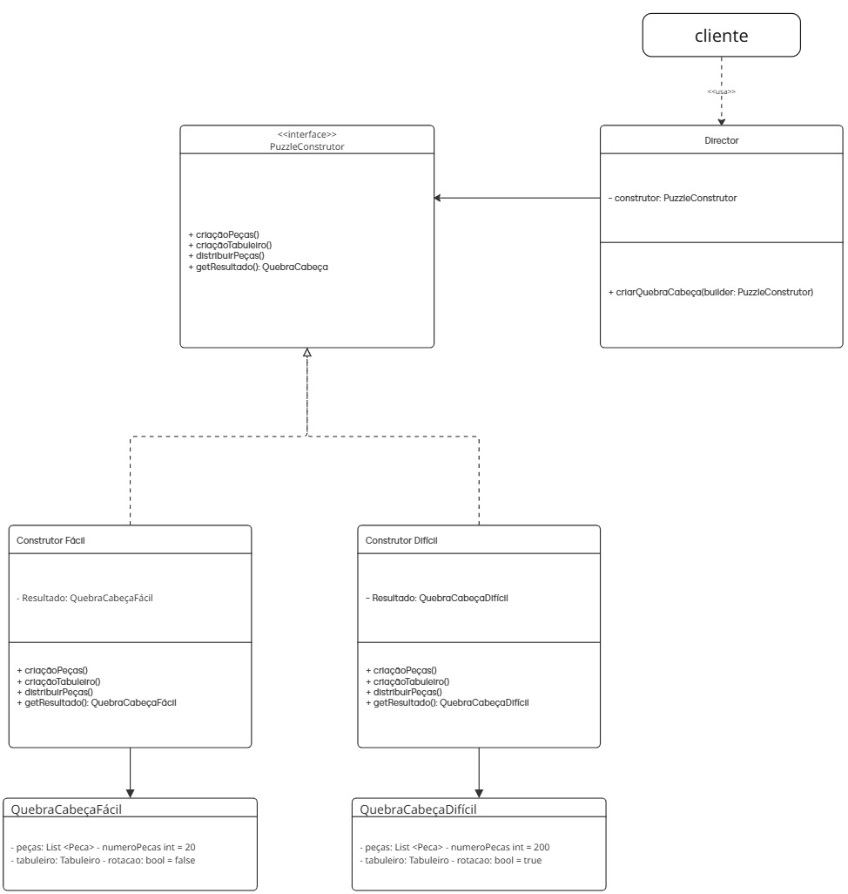

# 3.1.GOF Criacional

## 3.1.1.Diagrama Builder

<iframe width="768" height="432" src="https://miro.com/app/live-embed/uXjVGnju0LM=/?embedMode=view_only_without_ui&moveToViewport=1260,5395,2143,2001&embedId=492779134473" frameborder="0" scrolling="no" allow="fullscreen; clipboard-read; clipboard-write" allowfullscreen></iframe>

    
    <figcaption>Diagrama de padrão builder. Autores: Integrantes do grupo</figcaption>

## 3.1.2.Metodologia

Para a elaboração desse diagrama, foi utilizado a ferramente online Miro. As referências principais para a elaboração do diagrama foram os slides do conteúdo disponibilizado pela profª Serrano e o site refactoring guru. 

A construção inicial desse diagrama ficou encarregada ao [Lucas Ricarte](https://github.com/Lucas-Ricarte) e iremos aperfeiçoar com os demais componentes do grupo durante o desenvolvimento da entrega.

Para a análise de responsabilidades do padrão, foram aplicados os princípios GRASP conforme definidos por LARMAN, Craig. Utilizando UML e Padrões. 3. ed. Porto Alegre: Bookman, 2007.

## 3.1.3.Justificativa

A escolha do GOF criacional builder se deu por conta da feature de dificuldade dos quebra-cabeças. O processo de criação de um quebra-cabeça exige a configuração de várias etapas complexas, como carregar a imagem e cortá-la em vários pedaços com partes da imagem original, e, como tem diferentes dificuldades, teriamos que implementar de várias maneiras diferentes. Com o padrão builder, podemos criar um construtor com as etapas padrão de elaboração de um quebra-cabeça e especificar em outros construtores como deve ser a construção de um quebra-cabeça de uma certa dificuldade.

## 3.1.4.Visão do contribuidor na concepção do diagrama

* **Lucas**: inicialmente elaborei o diagrama com o intuito de mostrar a minha ideia em relação ao GOF estrutural, justificando a escolha do padrão builder, com o intuito de levantar discussões com os membros da equipe.
* **João**: Após elaboração do diagrama pelo colega, quis verificar os tópicos referentes à criação e fazer as devidas correções com relação a relacionamentos e nomenclaturas.

## 3.1.5.Análise GRASP

| Princípio GRASP | Como se manifesta no diagrama |
|---|---|
| **Criador** | Cada construtor concreto cria seu próprio produto: `ConstrutorFácil` → `QuebraCabeçaFácil`, `ConstrutorMédio` → `QuebraCabeçaMédio`, `ConstrutorDifícil` → `QuebraCabeçaDifícil` |
| **Baixo Acoplamento** | O `Director` continua referenciando apenas `PuzzleConstrutor` — a adição do terceiro construtor não gerou nenhum acoplamento novo |
| **Alta Coesão** | Os três construtores concretos são coesos: cada um concentra exclusivamente as regras de montagem do seu modo de dificuldade |
| **Indireção** | A interface `PuzzleConstrutor` intermedia `Director` e os três construtores concretos — nenhum conhece o outro diretamente |
| **Variações Protegidas** | A inclusão do `ConstrutorMédio` é a demonstração empírica deste princípio: o sistema foi estendido sem propagar mudanças para `Director` ou para os demais construtores |

## 3.1.6.Análise de complexidade

Em termos de complexidade, o Director possui complexidade ciclomática mínima — o método criarQuebraCabeça(builder) orquestra as chamadas em sequência fixa, sem ramificações. A complexidade relevante reside nos construtores concretos: a criação das peças é O(n), onde n é o número de peças do produto resultante — 25 no modo fácil, 36 no modo médio e 64 no modo difícil.

## 3.1.7.Implementação

O padrão Builder foi implementado no módulo builder/ do backend, composto pelos seguintes arquivos:

- base.py — interface PuzzleConstrutor com os métodos abstratos criacaoPecas(), criacaoTabuleiro(), distribuirPecas() e getResultado()
- construtor_facil.py — construtor concreto para grade 5x5 (25 peças), sem rotação
- construtor_medio.py — construtor concreto para grade 6x6 (36 peças), sem rotação
- construtor_dificil.py — construtor concreto para grade 8x8 (64 peças), com rotação habilitada
- puzzle.py — produtos QuebraCabecaFacil, QuebraCabecaMedio e QuebraCabecaDificil
- director.py — orquestra os passos de construção e retorna o resultado via ResultPayload

  

    

      
      
      
      composite/component.py
    

    
  

  <figcaption style="margin-top:8px;">Código do Builder - Autores: Integrantes do grupo</figcaption>

## Referências bibliográficas

* Explicação e exemplo da elaboração do GOF: Disponível em https://refactoring.guru/pt-br/design-patterns/builder
* LARMAN, Craig. Utilizando UML e Padrões: uma introdução à análise e ao projeto orientados a objetos e ao desenvolvimento iterativo. 3. ed. Porto Alegre: Bookman, 2007.
* GAMMA, Erich; HELM, Richard; JOHNSON, Ralph; VLISSIDES, John. Padrões de projeto: soluções reutilizáveis de software orientado a objetos. Porto Alegre: Bookman, 2000.

## Histórico de versão

| Data | Alterações | Autores |
| ---- | ---------- | ------- |
| 15/05/2026 | Primeira versão do diagrama builder    | Lucas        |
| 17/05/2026 | Segunda versão com correções e ajustes | João Eduardo |  
| 22/05/2026 | Análise de complexidade,análise GRASP e referências bibliográficas | Fábio Torres | 
| 22/05/2026 | Documentação implementação | Eduardo Morais | 