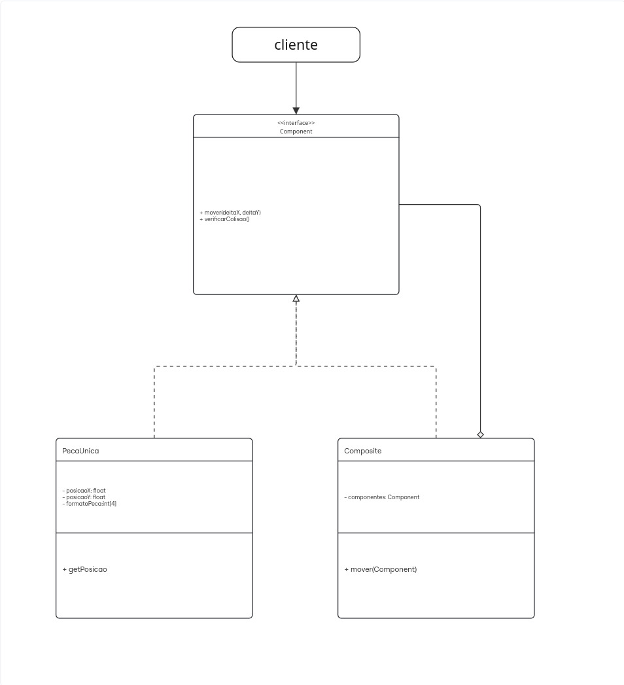

# 3.2.GOF Estrutural

## 3.2.1.Diagrama Composite

<iframe width="768" height="432" src="https://miro.com/app/live-embed/uXjVGnju0LM=/?embedMode=view_only_without_ui&moveToViewport=109,8115,1547,1507&embedId=41694835500" frameborder="0" scrolling="no" allow="fullscreen; clipboard-read; clipboard-write" allowfullscreen></iframe>

    
    <figcaption>Diagrama de padrão builder. Autores: Integrantes do grupo</figcaption>

## 3.2.2.Metodologia

Para a elaboração desse diagrama, foi utilizado a ferramente online Miro. As referências principais para a elaboração do diagrama foram os slides do conteúdo disponibilizado pela profª Serrano e o site refactoring guru. 

A construção inicial desse diagrama ficou encarrada ao [Lucas Ricarte](https://github.com/Lucas-Ricarte) e iremos aperfeiçoar com os demais componetes do grupo durante o desenvolvimento da entrega.

## 3.2.3.Justificativa

O GOF estrutural composite foi importante para decidirmos como seria implementado a lógica de jogar o quebra-cabeça. Tivemos varias discussões em grupo de como fariamos a junção das peças, se seria feita com o local delas preestabelecido ou tentano juntar elas liveremente. Porém essa última opção estava mais complicada por não termos conhecimento de como implementá-la. Então, com a descoberta do composite, possibilita a implementação da lógica de vários conjuntos de peças separados para depois construir o quebra-cabeça inteiro

## 3.2.4.Visão do contribuidor na concepção do diagrama

* **Lucas**: inicialmente elaborei o diagrama com o intuito de mostrar a minha ideia em relação ao GOF estrutural, justificando a escolha do padrão composite, com o intuito de levantar discussões com os membros da equipe.

* **João**: Após elaboração do diagrama pelo colega, quis verificar os tópicos referentes à criação e fazer as devidas correções com relação a relacionamentos e nomenclaturas.

## 3.2.5.Implementação

O padrão Composite foi implementado no módulo `composite/` do backend, composto pelos seguintes arquivos:

- `component.py` — interface Component com os métodos `mover()`, `verificarColisao()` e `getPosicao()`
- `peca_unica.py` — folha PecaUnica, representa cada peça individual com posição atual, posição correta e tolerância de encaixe
- `composite.py` — Composite, agrupa peças já encaixadas tratando-as como uma única unidade, suportando grupos de grupos

  

    

      
      
      
      composite/component.py
    

    
  

  <figcaption style="margin-top:8px;">Código do Composite - Autores: Integrantes do grupo</figcaption>

## Referências bibliográficas

* Explicação e exemplo da elaboração do GOF: Disponível em https://refactoring.guru/pt-br/design-patterns/composite

## Histórico de versão

| Data | Alterações | Autores |
| ---- | ---------- | ------- |
| 15/05/2026 | Primeira versão do diagrama composite  | Lucas        |
| 17/05/2026 | Segunda versão com correções e ajustes | João Eduardo |
| 22/05/2026 | Documentação implementação | Eduardo Morais |  