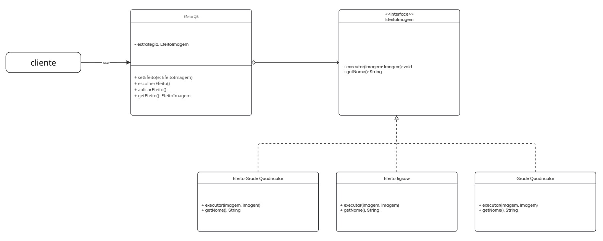

# 3.3.GOF Comportamental

## 3.3.1.Diagrama Comportamental

<iframe width="768" height="432" src="https://miro.com/app/live-embed/uXjVGnju0LM=/?embedMode=view_only_without_ui&moveToViewport=2533,8094,2889,1373&embedId=998370953026" frameborder="0" scrolling="no" allow="fullscreen; clipboard-read; clipboard-write" allowfullscreen></iframe>

    
    <figcaption>Diagrama de padrão builder. Autores: Integrantes do grupo</figcaption>

## 3.3.2.Metodologia

Para a elaboração desse diagrama, foi utilizado a ferramente online Miro. As referências principais para a elaboração do diagrama foram os slides do conteúdo disponibilizado pela profª Serrano e o site refactoring guru. 

A construção inicial desse diagrama ficou encarrada ao [Lucas Ricarte](https://github.com/Lucas-Ricarte) e iremos aperfeiçoar com os demais componetes do grupo durante o desenvolvimento da entrega..

## 3.3.3.Justificativa

A escolha do GOF comportamental strategy se deu por conta da feature de escolha do algoritmo de corte. Como os algoritmos tem diferentes comportamentos, fazer a implementação deles sem um padrão de pojeto seria difícil de manter, por ter vaŕias lógicas aclopadas a cada um. Com a implementação do padrão strategy, a implementação se torna mais fácil, fazendo com que se tenha um objeto e vários comportamentos alocados. Então, quando precisar, por exemplo, adicionar um comportamento, não precisará modificar a lógica do objeto.

## 3.3.4.Visão do contribuidor na concepção do diagrama

* **Lucas**: inicialmente elaborei o diagrama com o intuito de mostrar a minha ideia em relação ao GOF estrutural, justificando a escolha do padrão builder, com o intuito de levantar discussões com os membros da equipe.

* **João**: Após elaboração do diagrama pelo colega, quis verificar os tópicos referentes à criação e fazer as devidas correções com relação a relacionamentos e nomenclaturas.

## Referências bibliográficas

* Explicação e exemplo da elaboração do GOF: Disponível em https://refactoring.guru/pt-br/design-patterns/strategy

## Histórico de versão

| Data | Alterações | Autores |
| ---- | ---------- | ------- |
| 15/05/2026 | Primeira versão do diagrama strategy   | Lucas        |
| 17/05/2026 | Segunda versão com correções e ajustes | João Eduardo |  